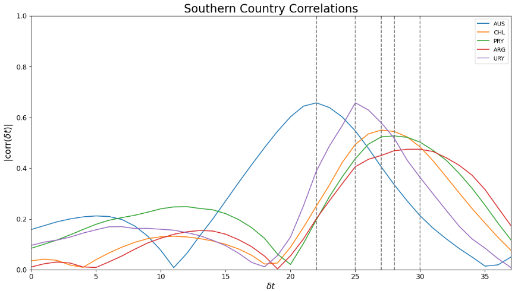

# Flu modeling project

## Motivation
Efforts to reliably forecast influenza seasonal illnesses have long been a challange due to a variety of factors: virus mutation, vaccine efficacy, population willingness to become vaccinated, etc. An accurate inflluenza forecast can help hospital preperation for incoming patients as well as prepare drug manufacturers and distributers to have adaquate supply.

In an effort to prepare for influenza related pharmaceutical purchasing, I have created this repository for estimating flu severity in the U.S. utilizing southern hemisphere flu rates as predictors. In order to ensure patients have their medications during the flu season, the suppliers that manufacture the pharmaceuticals need as much notice as possible. Estimating the flu season as early as the summer before can give suppliers the adaquate time needed to prepare the necessary supply. Typical state of the art techniques have a forecast range of ~1-4 weeks, so this approach sacrifices some of the week-to-week accuracy in order to increase the forecasting power to ~5-6 months.

## Data
In the pharmaceutical sourcing space, drug distributors forecast seasonal illness demand months before the season takes place. Due to the length of the required forecast, Austrailia's flu season is often used to estimate the incoming U.S. season due to the nature of the southern hemisphere experiencing winter when the northern hemisphere is in summer. My hypthoses is that some combination of southern hemisphere countrys' flu seasons can provide a rough forecast for the U.S., more accurate than previously copying and pasting Australia's season over the U.S. Data used in this project comes from the WHO as well as the CDC's FluSurv-NET data set and can be found below.

WHO data available at https://www.who.int/teams/global-influenza-programme/surveillance-and-monitoring/influenza-surveillance-outputs

CDC data available at https://gis.cdc.gov/GRASP/Fluview/FluHospRates.html

The target data used to estimate influenza severity is CDC's FluSurv-NET dataset, which details patient hospitalization information in participating hospitals representing ~9% of the U.S. population. This was chosen because patients that have undergone viral testing in a hospital setting likely have reliable results. The most accurate publicly available influenza dataset for global rates belongs to the WHO, where I first determine which countrys' flu seasons are highly correlated with the U.S.

    
    <caption>Countries with highest correlation with the U.S. flu season in the "sweet spot" (~5-6months before the U.S. season). </caption>

    
    <caption>The seasons in blue were both done using the previous season as the validation set. Due to Covid and previous data availability, the 22-23 season (red) was the first season used as validation to stop the training and therefore carries a bias. </caption>

