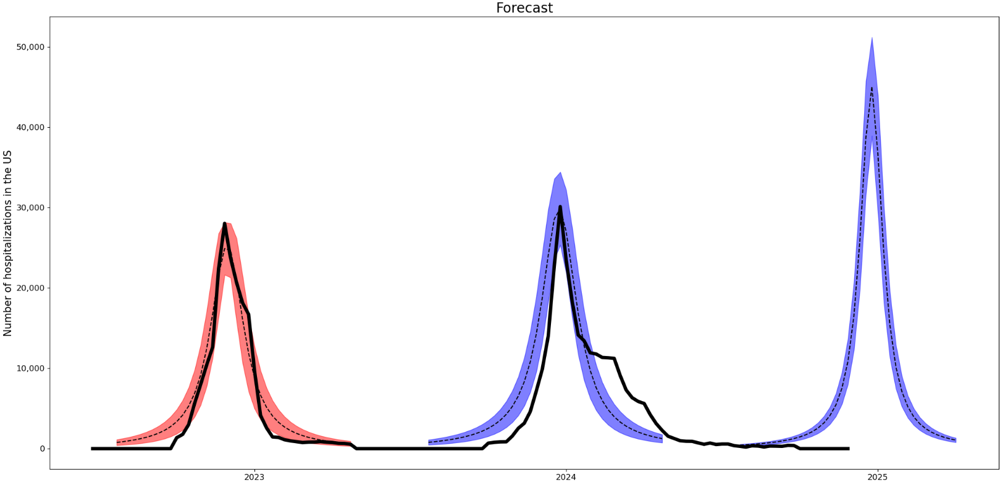

# Flu modeling project

## Data Locations

WHO data available at https://www.who.int/teams/global-influenza-programme/surveillance-and-monitoring/influenza-surveillance-outputs

CDC data available at https://gis.cdc.gov/GRASP/Fluview/FluHospRates.html

